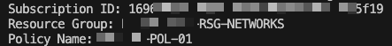

use: "**connect-azaccount**" for authentication before running the script

when running the script you will have to manually insert:

**Subscription ID:**

**Resource Group:**

**Policy Name:**

the script will return the "firewall-policy-rules.csv" file in the current script location with the relevand information
